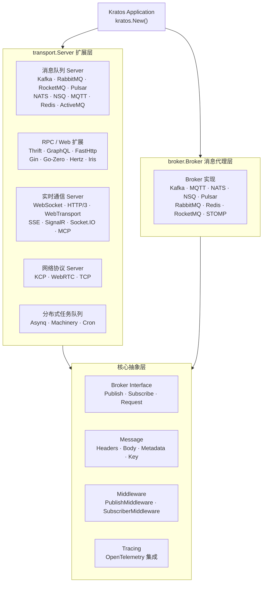

<p align="center">
  <h1 align="center">Kratos Transport</h1>
  <p align="center">
    为 <a href="https://go-kratos.dev/">Kratos</a> 微服务框架打造的统一传输层与消息代理扩展集
  </p>
  <p align="center">
    <em>一套抽象，30+ 传输协议全覆盖，开箱即用</em>
  </p>
</p>

<p align="center">
  <a href="README.md">中文</a> · <a href="README_en.md">English</a> · <a href="README_ja.md">日本語</a>
</p>

<p align="center">
  
  
  
  
  
  
</p>

---

## 项目亮点

- **30+ 传输协议与消息中间件适配**：RabbitMQ、Kafka、RocketMQ、Pulsar、NATS、NSQ、MQTT、Redis Stream、WebSocket、HTTP/3、WebTransport、SSE、SignalR、Socket.IO、MCP、KCP、WebRTC…… 一站式覆盖主流消息队列、RPC 框架与实时通信协议
- **双模式接入**：`transport.Server` 实现可直接注册到 Kratos 服务生命周期；独立 `broker.Broker` 接口支持纯消息代理场景，按需选用
- **泛型类型安全**：基于 Go 1.18+ 泛型提供 `TypedHandler[T]`、`Subscribe[T]`、`RegisterSubscriber[S, T]` 等类型安全 API，告别 `interface{}` 运行时恐慌
- **统一消息抽象**：`broker.Message` 统一封装 Headers / Body / Metadata / Partition / Offset，屏蔽底层协议差异
- **可观测性就绪**：内置 OpenTelemetry 链路追踪集成，支持 OTLP gRPC/HTTP、Jaeger、Zipkin 等主流 Exporter，发布 / 订阅全链路 Trace
- **中间件链**：Publish / Subscribe 双向中间件机制，可灵活注入日志、指标、链路追踪、限流等横切关注点
- **模块化按需引入**：每个 transport / broker 实现独立 Go Module，只引入你需要的依赖，避免依赖膨胀

---

## 架构概览



---

## 支持能力一览

### 消息队列 Transport Server

| 中间件 | 说明 | 文档 |
|--------|------|------|
| RabbitMQ | AMQP 0-9-1 协议，广泛用于企业异步消息 | [README](./transport/rabbitmq/README.md) |
| Kafka | 高吞吐分布式事件流平台 | [README](./transport/kafka/README.md) |
| RocketMQ | 阿里云级分布式消息中间件 | [README](./transport/rocketmq/README.md) |
| ActiveMQ | STOMP 协议接入 ActiveMQ / Apollo | [README](./transport/activemq/README.md) |
| Pulsar | Apache Pulsar 云原生消息平台 | [README](./transport/pulsar/README.md) |
| NATS | 轻量高性能消息系统 | [README](./transport/nats/README.md) |
| NSQ | 实时分布式消息平台 | [README](./transport/nsq/README.md) |
| Redis | Redis Stream 消息消费 | [README](./transport/redis/README.md) |
| MQTT | 物联网 MQTT v3.1.1 / v5.0 协议 | [README](./transport/mqtt/README.md) |

### RPC / Web 框架扩展

| 框架 | 说明 | 文档 |
|------|------|------|
| Thrift | Apache Thrift RPC 协议 | [README](./transport/thrift/README.md) |
| GraphQL | GraphQL 查询语言 | [README](./transport/graphql/README.md) |
| FastHttp | 高性能 HTTP 框架 fasthttp | [README](./transport/fasthttp/README.md) |
| Gin | Gin Web 框架 | [README](./transport/gin/README.md) |
| Go-Zero | go-zero 微服务框架 | [README](./transport/gozero/README.md) |
| Hertz | 字节跳动 CloudWeGo Hertz HTTP 框架 | [README](./transport/hertz/README.md) |
| Iris | Iris Web 框架 | [README](./transport/iris/README.md) |
| tRPC | 腾讯 tRPC 微服务框架 | [README](./transport/trpc/README.md) |

### 分布式任务队列

| 框架 | 说明 | 文档 |
|------|------|------|
| Asynq | 基于 Redis 的异步任务队列 | [README](./transport/asynq/README.md) |
| Machinery | 分布式任务处理框架 | [README](./transport/machinery/README.md) |
| Cron | 定时任务调度 | [README](./transport/cron/README.md) |
| HPTimer | 高精度定时器 | [README](./transport/hptimer/README.md) |

### 实时通信协议

| 协议 | 说明 | 文档 |
|------|------|------|
| WebSocket | 全双工实时通信 | [README](./transport/websocket/README.md) |
| HTTP/3 | 基于 QUIC 的下一代 HTTP 协议 | [README](./transport/http3/README.md) |
| WebTransport | 基于 QUIC 的 Web 传输协议 | [README](./transport/webtransport/README.md) |
| SSE | Server-Sent Events 服务端推送 | [README](./transport/sse/README.md) |
| SignalR | ASP.NET SignalR 协议 | [README](./transport/signalr/README.md) |
| Socket.IO | Socket.IO 实时通信协议 | [README](./transport/socketio/README.md) |
| MCP | Model Context Protocol (AI Agent 通信) | [README](./transport/mcp/README.md) |

### 网络协议

| 协议 | 说明 | 文档 |
|------|------|------|
| KCP | 可靠 UDP 协议 | [README](./transport/kcp/README.md) |
| WebRTC | 点对点实时通信 | [README](./transport/webrtc/README.md) |
| TCP | 原始 TCP 长连接 | [README](./transport/tcp/README.md) |

### Broker 消息代理

| 中间件 | 说明 | 文档 |
|--------|------|------|
| Kafka | 高吞吐事件流 | [README](./broker/kafka/README.md) |
| MQTT | 物联网消息协议 | [README](./broker/mqtt/README.md) |
| NATS | 轻量级消息系统 | [README](./broker/nats/README.md) |
| NSQ | 实时消息平台 | [README](./broker/nsq/README.md) |
| Pulsar | 云原生消息平台 | [README](./broker/pulsar/README.md) |
| RabbitMQ | AMQP 消息中间件 | [README](./broker/rabbitmq/README.md) |
| Redis | Redis Stream 消息 | [README](./broker/redis/README.md) |
| RocketMQ | 阿里分布式消息中间件 | [README](./broker/rocketmq/README.md) |
| STOMP | STOMP 协议消息中间件 | [README](./broker/stomp/README.md) |

---

## 技术栈

| 层级 | 技术 | 说明 |
|------|------|------|
| 语言 | Go 1.24+ | 高性能编译型语言 |
| 框架 | go-kratos v2 | B 站开源微服务框架 |
| 链路追踪 | OpenTelemetry | 统一可观测性标准 |
| Exporter | OTLP / Jaeger / Zipkin | 多种 Trace 导出后端 |
| 编解码 | JSON / Protobuf | 灵活的序列化方案 |
| TLS | crypto/tls | 安全传输层支持 |

---

## 快速开始

### 安装

根据需要按模块引入：

```bash
# Transport Server
go get github.com/tx7do/kratos-transport/transport/kafka
go get github.com/tx7do/kratos-transport/transport/rabbitmq
go get github.com/tx7do/kratos-transport/transport/websocket
go get github.com/tx7do/kratos-transport/transport/sse

# Broker
go get github.com/tx7do/kratos-transport/broker/kafka
go get github.com/tx7do/kratos-transport/broker/redis
```

### 作为 Transport Server 接入 Kratos

```go
package main

import (
    "context"
    "log"

    "github.com/go-kratos/kratos/v2"
    kfk "github.com/tx7do/kratos-transport/transport/kafka"
)

type Event struct {
    Message string `json:"message"`
}

func main() {
    ctx := context.Background()

    kafkaSrv := kfk.NewServer(
        kfk.WithAddress("localhost:9092"),
        kfk.WithSubscribe("test-topic", "test-group", handleMessage),
    )

    app := kratos.New(
        kratos.Name("my-service"),
        kratos.Server(kafkaSrv),
    )

    if err := app.Run(); err != nil {
        log.Fatal(err)
    }
}

func handleMessage(ctx context.Context, topic string, headers broker.Headers, msg *Event) error {
    log.Printf("received: %s", msg.Message)
    return nil
}
```

### 作为独立 Broker 使用

```go
package main

import (
    "context"
    "log"

    "github.com/tx7do/kratos-transport/broker"
    kfk "github.com/tx7do/kratos-transport/broker/kafka"
)

func main() {
    ctx := context.Background()

    b := kfk.NewBroker(
        broker.WithAddress("localhost:9092"),
    )

    if err := b.Connect(); err != nil {
        log.Fatal(err)
    }
    defer b.Disconnect()

    // 发布消息
    _ = b.Publish(ctx, "test-topic", broker.NewMessage([]byte(`{"hello":"world"}`)))

    // 订阅消息
    _, _ = broker.Subscribe[[]byte](b, "test-topic",
        func(ctx context.Context, topic string, headers broker.Headers, msg *[]byte) error {
            log.Printf("received: %s", string(*msg))
            return nil
        },
    )
}
```

---

## 核心抽象

### Broker Interface

`broker.Broker` 是所有消息代理实现的顶层接口：

```go
type Broker interface {
    Name() string
    Options() Options
    Address() string
    Init(...Option) error
    Connect() error
    Disconnect() error
    Publish(ctx context.Context, topic string, msg *Message, opts ...PublishOption) error
    Subscribe(topic string, handler Handler, binder Binder, opts ...SubscribeOption) (Subscriber, error)
    Request(ctx context.Context, topic string, msg *Message, opts ...RequestOption) (*Message, error)
}
```

### Message

统一消息模型，屏蔽底层协议差异：

```go
type Message struct {
    ID        string          // 消息 ID
    Headers   Headers         // 消息头
    Body      any             // 消息体
    Key       string          // 分区键（Kafka Key / RabbitMQ RoutingKey）
    Metadata  Metadata        // 元数据
    Partition int             // 分区号
    Offset    int64           // 偏移量
    Msg       any             // 原始消息
}
```

### 泛型 Handler

利用 Go 泛型实现编译期类型安全：

```go
// 泛型订阅（Broker 层）
broker.Subscribe[MyEvent](b, "topic", handler)

// 泛型注册（Transport 层）
transport.RegisterSubscriber[MyServer](srv, ctx, "topic", "group", false, handler)
```

### 中间件

支持 Publish / Subscribe 双向中间件链：

```go
// 发布中间件
b := kfk.NewBroker(
    broker.WithPublishMiddlewares(loggingMiddleware, tracingMiddleware),
)

// 订阅中间件
b := kfk.NewBroker(
    broker.WithSubscriberMiddlewares(metricsMiddleware, recoveryMiddleware),
)
```

---

## 项目结构

```
kratos-transport/
├── broker/                     # 消息代理抽象与多实现
│   ├── kafka/                  # Kafka Broker
│   ├── mqtt/                   # MQTT Broker
│   ├── nats/                   # NATS Broker
│   ├── nsq/                    # NSQ Broker
│   ├── pulsar/                 # Pulsar Broker
│   ├── rabbitmq/               # RabbitMQ Broker
│   ├── redis/                  # Redis Broker
│   ├── rocketmq/               # RocketMQ Broker
│   ├── stomp/                  # STOMP Broker
│   ├── broker.go               # Broker 接口定义
│   ├── message.go              # 统一消息模型
│   ├── options.go              # Broker 全局配置
│   ├── publish.go              # 发布中间件链
│   ├── subscriber.go           # 订阅者管理（线程安全）
│   └── typed_handler.go        # 泛型 Handler
├── transport/                  # Transport Server 扩展
│   ├── activemq/               # ActiveMQ Transport
│   ├── asynq/                  # Asynq 异步任务队列
│   ├── cron/                   # 定时任务调度
│   ├── fasthttp/               # FastHttp Transport
│   ├── gin/                    # Gin Transport
│   ├── gozero/                 # Go-Zero Transport
│   ├── graphql/                # GraphQL Transport
│   ├── hertz/                  # Hertz Transport
│   ├── hptimer/                # 高精度定时器
│   ├── http3/                  # HTTP/3 + QUIC Transport
│   ├── iris/                   # Iris Transport
│   ├── kafka/                  # Kafka Transport
│   ├── kcp/                    # KCP Transport
│   ├── keepalive/              # Keep-Alive Transport
│   ├── machinery/              # Machinery 任务队列
│   ├── mcp/                    # MCP (Model Context Protocol)
│   ├── mqtt/                   # MQTT Transport
│   ├── nats/                   # NATS Transport
│   ├── nsq/                    # NSQ Transport
│   ├── pulsar/                 # Pulsar Transport
│   ├── rabbitmq/               # RabbitMQ Transport
│   ├── redis/                  # Redis Transport
│   ├── rocketmq/               # RocketMQ Transport
│   ├── signalr/                # SignalR Transport
│   ├── socketio/               # Socket.IO Transport
│   ├── sse/                    # SSE Transport
│   ├── tcp/                    # TCP Transport
│   ├── thrift/                 # Thrift RPC Transport
│   ├── trpc/                   # tRPC Transport
│   ├── webrtc/                 # WebRTC Transport
│   ├── websocket/              # WebSocket Transport
│   ├── webtransport/           # WebTransport Transport
│   ├── register.go             # 泛型订阅注册器
│   ├── options.go              # Transport 全局配置
│   └── utils.go                # 网络工具函数
├── tracing/                    # 链路追踪扩展
│   ├── provider.go             # TracerProvider 工厂
│   ├── exporter.go             # 多后端 Exporter
│   ├── tracer.go               # Trace 注入 / 提取
│   └── options.go              # 追踪配置
├── _example/                   # 示例工程
│   ├── broker/                 # Broker 使用示例
│   └── server/                 # Server 使用示例
├── testing/                    # 测试相关
├── script/                     # 辅助脚本
├── Makefile                    # 构建脚本
└── LICENSE                     # MIT 开源协议
```

---

## 示例项目

| 项目 | 说明 |
|------|------|
| [kratos-chatroom](https://github.com/tx7do/kratos-chatroom) | WebSocket 实时聊天室 |
| [kratos-cqrs](https://github.com/tx7do/kratos-cqrs) | CQRS 架构示例（Kafka + MongoDB） |
| [kratos-realtimemap](https://github.com/tx7do/kratos-realtimemap) | 物联网实时地图（MQTT + WebSocket） |
| [go-wind-uba](https://github.com/tx7do/go-wind-uba) | 企业级用户行为分析系统 |
| [go-wind-admin](https://github.com/tx7do/go-wind-admin) | 中后台管理系统脚手架 |

> 以上项目均收录于 [Kratos 官方 Examples](https://github.com/go-kratos/examples)。

---

## 适用场景

- **消息队列接入**：需要将 Kafka / RabbitMQ / RocketMQ 等消息队列统一纳入 Kratos 微服务框架管理
- **实时通信服务**：需要 WebSocket / SSE / SignalR / Socket.IO 等实时通信能力的微服务
- **物联网后端**：MQTT 协议接入物联网设备，配合实时推送
- **AI Agent 接入**：通过 MCP 协议为 AI Agent 提供工具调用能力
- **异步任务处理**：基于 Asynq / Machinery 构建分布式任务队列
- **多协议网关**：在同一服务内同时支持 HTTP / gRPC / Thrift / GraphQL 等多种协议
- **纯消息代理**：仅需消息发布 / 订阅能力，无需 Kratos 框架依赖

---

## 贡献

欢迎提交 Issue 和 Pull Request！

1. Fork 本仓库
2. 创建特性分支 (`git checkout -b feature/amazing-feature`)
3. 提交变更 (`git commit -m 'Add some amazing feature'`)
4. 推送到分支 (`git push origin feature/amazing-feature`)
5. 发起 Pull Request

---

## License

本项目基于 [MIT License](./LICENSE) 开源。
