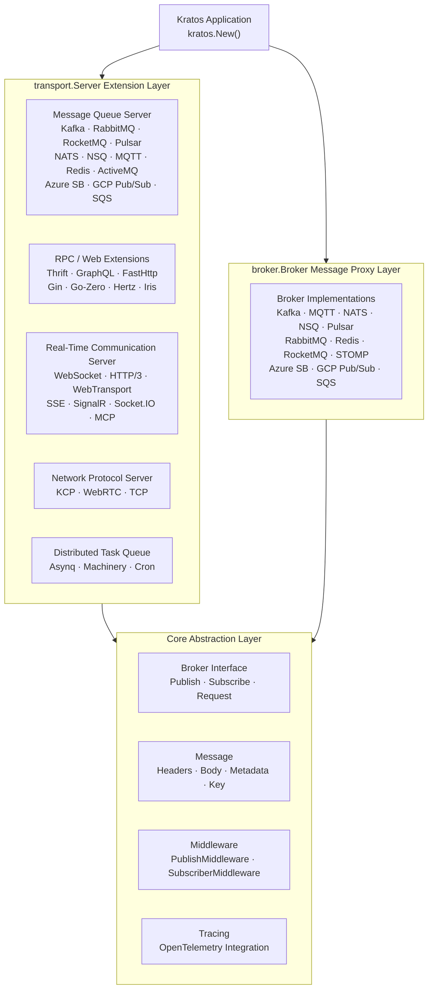

<p align="center">
  <h1 align="center">Kratos Transport</h1>
  <p align="center">
    A Unified Transport Layer & Message Broker Extension Suite for the <a href="https://go-kratos.dev/">Kratos</a> Microservice Framework
  </p>
  <p align="center">
    <em>One abstraction, 30+ transport protocols, ready out of the box</em>
  </p>
</p>

<p align="center">
  <a href="README.md">中文</a> · <a href="README_en.md">English</a> · <a href="README_ja.md">日本語</a>
</p>

<p align="center">
  
  
  
  
  
  
</p>

---

## Highlights

- **30+ Transport Protocol & Message Middleware Adapters**: RabbitMQ, Kafka, RocketMQ, Pulsar, NATS, NSQ, MQTT, Redis Stream, Azure Service Bus, GCP Pub/Sub, AWS SQS, WebSocket, HTTP/3, WebTransport, SSE, SignalR, Socket.IO, MCP, KCP, WebRTC... One-stop coverage of mainstream message queues, cloud messaging services, RPC frameworks, and real-time communication protocols
- **Dual-Mode Integration**: `transport.Server` implementations register directly into the Kratos service lifecycle; standalone `broker.Broker` interface supports pure message proxy scenarios — use as needed
- **Generic Type Safety**: Leverages Go 1.18+ generics to provide `TypedHandler[T]`, `Subscribe[T]`, `RegisterSubscriber[S, T]` and other type-safe APIs — say goodbye to `interface{}` runtime panics
- **Unified Message Abstraction**: `broker.Message` uniformly encapsulates Headers / Body / Metadata / Partition / Offset, shielding underlying protocol differences
- **Observability Ready**: Built-in OpenTelemetry distributed tracing integration, supporting OTLP gRPC/HTTP, Jaeger, Zipkin and other mainstream exporters — full-link tracing for publish/subscribe
- **Middleware Chain**: Bidirectional Publish / Subscribe middleware mechanism for flexible injection of cross-cutting concerns such as logging, metrics, tracing, and rate limiting
- **High-Reliability Message Delivery**: RabbitMQ supports Publisher Confirms, Publisher Returns, and multi-Exchange routing to ensure no message loss
- **Modular On-Demand Import**: Each transport / broker implementation is an independent Go Module — only import the dependencies you need, avoid dependency bloat

---

## Architecture Overview



---

## Supported Capabilities

### Message Queue Transport Server

| Middleware | Description | Docs |
|------------|-------------|------|
| RabbitMQ | AMQP 0-9-1 protocol, widely used for enterprise async messaging | [README](./transport/rabbitmq/README.md) |
| Kafka | High-throughput distributed event streaming platform | [README](./transport/kafka/README.md) |
| RocketMQ | Alibaba-grade distributed message middleware | [README](./transport/rocketmq/README.md) |
| ActiveMQ | STOMP protocol for ActiveMQ / Apollo | [README](./transport/activemq/README.md) |
| Pulsar | Apache Pulsar cloud-native messaging platform | [README](./transport/pulsar/README.md) |
| NATS | Lightweight high-performance messaging system | [README](./transport/nats/README.md) |
| NSQ | Real-time distributed messaging platform | [README](./transport/nsq/README.md) |
| Redis | Redis Stream message consumption | [README](./transport/redis/README.md) |
| MQTT | IoT MQTT v3.1.1 / v5.0 protocol | [README](./transport/mqtt/README.md) |
| Azure Service Bus | Azure cloud messaging queue service | [README](./broker/azuresb/README.md) |
| GCP Pub/Sub | Google Cloud publish/subscribe messaging service | [README](./broker/gcpubsub/README.md) |
| AWS SQS | Amazon Simple Queue Service | [README](./broker/sqs/README.md) |

### RPC / Web Framework Extensions

| Framework | Description | Docs |
|-----------|-------------|------|
| Thrift | Apache Thrift RPC protocol | [README](./transport/thrift/README.md) |
| GraphQL | GraphQL query language | [README](./transport/graphql/README.md) |
| FastHttp | High-performance HTTP framework fasthttp | [README](./transport/fasthttp/README.md) |
| Gin | Gin web framework | [README](./transport/gin/README.md) |
| Go-Zero | go-zero microservice framework | [README](./transport/gozero/README.md) |
| Hertz | ByteDance CloudWeGo Hertz HTTP framework | [README](./transport/hertz/README.md) |
| Iris | Iris web framework | [README](./transport/iris/README.md) |
| tRPC | Tencent tRPC microservice framework | [README](./transport/trpc/README.md) |

### Distributed Task Queues

| Framework | Description | Docs |
|-----------|-------------|------|
| Asynq | Redis-based async task queue | [README](./transport/asynq/README.md) |
| Machinery | Distributed task processing framework | [README](./transport/machinery/README.md) |
| Cron | Scheduled task dispatching | [README](./transport/cron/README.md) |
| HPTimer | High-precision timer | [README](./transport/hptimer/README.md) |

### Real-Time Communication Protocols

| Protocol | Description | Docs |
|----------|-------------|------|
| WebSocket | Full-duplex real-time communication | [README](./transport/websocket/README.md) |
| HTTP/3 | Next-gen HTTP protocol based on QUIC | [README](./transport/http3/README.md) |
| WebTransport | Web transport protocol based on QUIC | [README](./transport/webtransport/README.md) |
| SSE | Server-Sent Events server push | [README](./transport/sse/README.md) |
| SignalR | ASP.NET SignalR protocol | [README](./transport/signalr/README.md) |
| Socket.IO | Socket.IO real-time communication protocol | [README](./transport/socketio/README.md) |
| MCP | Model Context Protocol (AI Agent communication) | [README](./transport/mcp/README.md) |

### Network Protocols

| Protocol | Description | Docs |
|----------|-------------|------|
| KCP | Reliable UDP protocol | [README](./transport/kcp/README.md) |
| WebRTC | Peer-to-peer real-time communication | [README](./transport/webrtc/README.md) |
| TCP | Raw TCP long connection | [README](./transport/tcp/README.md) |

### Broker Message Proxy

| Middleware | Description | Docs |
|------------|-------------|------|
| Kafka | High-throughput event streaming | [README](./broker/kafka/README.md) |
| MQTT | IoT messaging protocol | [README](./broker/mqtt/README.md) |
| NATS | Lightweight messaging system | [README](./broker/nats/README.md) |
| NSQ | Real-time messaging platform | [README](./broker/nsq/README.md) |
| Pulsar | Cloud-native messaging platform | [README](./broker/pulsar/README.md) |
| RabbitMQ | AMQP message middleware | [README](./broker/rabbitmq/README.md) |
| Redis | Redis Stream messaging | [README](./broker/redis/README.md) |
| RocketMQ | Alibaba distributed message middleware | [README](./broker/rocketmq/README.md) |
| STOMP | STOMP protocol message middleware | [README](./broker/stomp/README.md) |
| Azure Service Bus | Azure cloud messaging queue service | [README](./broker/azuresb/README.md) |
| GCP Pub/Sub | Google Cloud publish/subscribe messaging service | [README](./broker/gcpubsub/README.md) |
| AWS SQS | Amazon Simple Queue Service | [README](./broker/sqs/README.md) |

---

## Tech Stack

| Layer | Technology | Description |
|-------|-----------|-------------|
| Language | Go 1.24+ | High-performance compiled language |
| Framework | go-kratos v2 | Bilibili open-source microservice framework |
| Tracing | OpenTelemetry | Unified observability standard |
| Exporter | OTLP / Jaeger / Zipkin | Multiple trace export backends |
| Codec | JSON / Protobuf | Flexible serialization schemes |
| TLS | crypto/tls | Secure transport layer support |

---

## Quick Start

### Installation

Import modules as needed:

```bash
# Transport Server
go get github.com/tx7do/kratos-transport/transport/kafka
go get github.com/tx7do/kratos-transport/transport/rabbitmq
go get github.com/tx7do/kratos-transport/transport/websocket
go get github.com/tx7do/kratos-transport/transport/sse

# Broker
go get github.com/tx7do/kratos-transport/broker/kafka
go get github.com/tx7do/kratos-transport/broker/redis
```

### Integrating as Transport Server with Kratos

```go
package main

import (
    "context"
    "log"

    "github.com/go-kratos/kratos/v2"
    kfk "github.com/tx7do/kratos-transport/transport/kafka"
)

type Event struct {
    Message string `json:"message"`
}

func main() {
    ctx := context.Background()

    kafkaSrv := kfk.NewServer(
        kfk.WithAddress("localhost:9092"),
        kfk.WithSubscribe("test-topic", "test-group", handleMessage),
    )

    app := kratos.New(
        kratos.Name("my-service"),
        kratos.Server(kafkaSrv),
    )

    if err := app.Run(); err != nil {
        log.Fatal(err)
    }
}

func handleMessage(ctx context.Context, topic string, headers broker.Headers, msg *Event) error {
    log.Printf("received: %s", msg.Message)
    return nil
}
```

### Using as Standalone Broker

```go
package main

import (
    "context"
    "log"

    "github.com/tx7do/kratos-transport/broker"
    kfk "github.com/tx7do/kratos-transport/broker/kafka"
)

func main() {
    ctx := context.Background()

    b := kfk.NewBroker(
        broker.WithAddress("localhost:9092"),
    )

    if err := b.Connect(); err != nil {
        log.Fatal(err)
    }
    defer b.Disconnect()

    // Publish a message
    _ = b.Publish(ctx, "test-topic", broker.NewMessage([]byte(`{"hello":"world"}`)))

    // Subscribe to messages
    _, _ = broker.Subscribe[[]byte](b, "test-topic",
        func(ctx context.Context, topic string, headers broker.Headers, msg *[]byte) error {
            log.Printf("received: %s", string(*msg))
            return nil
        },
    )
}
```

---

## Core Abstractions

### Broker Interface

`broker.Broker` is the top-level interface for all message broker implementations:

```go
type Broker interface {
    Name() string
    Options() Options
    Address() string
    Init(...Option) error
    Connect() error
    Disconnect() error
    Publish(ctx context.Context, topic string, msg *Message, opts ...PublishOption) error
    Subscribe(topic string, handler Handler, binder Binder, opts ...SubscribeOption) (Subscriber, error)
    Request(ctx context.Context, topic string, msg *Message, opts ...RequestOption) (*Message, error)
}
```

### Message

Unified message model that shields underlying protocol differences:

```go
type Message struct {
    ID        string          // Message ID
    Headers   Headers         // Message headers
    Body      any             // Message body
    Key       string          // Partition key (Kafka Key / RabbitMQ RoutingKey)
    Metadata  Metadata        // Metadata
    Partition int             // Partition number
    Offset    int64           // Offset
    Msg       any             // Raw message
}
```

### Generic Handler

Leverages Go generics for compile-time type safety:

```go
// Generic subscribe (Broker layer)
broker.Subscribe[MyEvent](b, "topic", handler)

// Generic register (Transport layer)
transport.RegisterSubscriber[MyServer](srv, ctx, "topic", "group", false, handler)
```

### Middleware

Supports bidirectional Publish / Subscribe middleware chains:

```go
// Publish middleware
b := kfk.NewBroker(
    broker.WithPublishMiddlewares(loggingMiddleware, tracingMiddleware),
)

// Subscribe middleware
b := kfk.NewBroker(
    broker.WithSubscriberMiddlewares(metricsMiddleware, recoveryMiddleware),
)
```

---

## Project Structure

```
kratos-transport/
├── broker/                     # Message broker abstraction & implementations
│   ├── kafka/                  # Kafka Broker
│   ├── mqtt/                   # MQTT Broker
│   ├── nats/                   # NATS Broker
│   ├── nsq/                    # NSQ Broker
│   ├── pulsar/                 # Pulsar Broker
│   ├── rabbitmq/               # RabbitMQ Broker
│   ├── redis/                  # Redis Broker
│   ├── rocketmq/               # RocketMQ Broker
│   ├── azuresb/                # Azure Service Bus Broker
│   ├── gcpubsub/               # GCP Pub/Sub Broker
│   ├── sqs/                    # AWS SQS Broker
│   ├── stomp/                  # STOMP Broker
│   ├── broker.go               # Broker interface definition
│   ├── message.go              # Unified message model
│   ├── options.go              # Broker global configuration
│   ├── publish.go              # Publish middleware chain
│   ├── subscriber.go           # Subscriber management (thread-safe)
│   └── typed_handler.go        # Generic Handler
├── transport/                  # Transport Server extensions
│   ├── activemq/               # ActiveMQ Transport
│   ├── asynq/                  # Asynq async task queue
│   ├── azuresb/               # Azure Service Bus Transport
│   ├── cron/                   # Scheduled task dispatching
│   ├── fasthttp/               # FastHttp Transport
│   ├── gcpubsub/               # GCP Pub/Sub Transport
│   ├── gin/                    # Gin Transport
│   ├── gozero/                 # Go-Zero Transport
│   ├── graphql/                # GraphQL Transport
│   ├── hertz/                  # Hertz Transport
│   ├── hptimer/                # High-precision timer
│   ├── http3/                  # HTTP/3 + QUIC Transport
│   ├── iris/                   # Iris Transport
│   ├── kafka/                  # Kafka Transport
│   ├── kcp/                    # KCP Transport
│   ├── keepalive/              # Keep-Alive Transport
│   ├── machinery/              # Machinery task queue
│   ├── mcp/                    # MCP (Model Context Protocol)
│   ├── mqtt/                   # MQTT Transport
│   ├── nats/                   # NATS Transport
│   ├── nsq/                    # NSQ Transport
│   ├── pulsar/                 # Pulsar Transport
│   ├── rabbitmq/               # RabbitMQ Transport
│   ├── redis/                  # Redis Transport
│   ├── rocketmq/               # RocketMQ Transport
│   ├── signalr/                # SignalR Transport
│   ├── socketio/               # Socket.IO Transport
│   ├── sqs/                    # AWS SQS Transport
│   ├── sse/                    # SSE Transport
│   ├── tcp/                    # TCP Transport
│   ├── thrift/                 # Thrift RPC Transport
│   ├── trpc/                   # tRPC Transport
│   ├── webrtc/                 # WebRTC Transport
│   ├── websocket/              # WebSocket Transport
│   ├── webtransport/           # WebTransport Transport
│   ├── register.go             # Generic subscribe registrar
│   ├── options.go              # Transport global configuration
│   └── utils.go                # Network utility functions
├── tracing/                    # Distributed tracing extension
│   ├── provider.go             # TracerProvider factory
│   ├── exporter.go             # Multi-backend Exporter
│   ├── tracer.go               # Trace inject / extract
│   └── options.go              # Tracing configuration
├── _example/                   # Example projects
│   ├── broker/                 # Broker usage examples
│   └── server/                 # Server usage examples
├── testing/                    # Testing utilities
├── script/                     # Helper scripts
├── Makefile                    # Build script
└── LICENSE                     # MIT License
```

---

## Example Projects

| Project | Description |
|---------|-------------|
| [kratos-chatroom](https://github.com/tx7do/kratos-chatroom) | WebSocket real-time chat room |
| [kratos-cqrs](https://github.com/tx7do/kratos-cqrs) | CQRS architecture example (Kafka + MongoDB) |
| [kratos-realtimemap](https://github.com/tx7do/kratos-realtimemap) | IoT real-time map (MQTT + WebSocket) |
| [go-wind-uba](https://github.com/tx7do/go-wind-uba) | Enterprise-grade user behavior analytics system |
| [go-wind-admin](https://github.com/tx7do/go-wind-admin) | Admin dashboard scaffold |

> All projects above are listed in the [Kratos Official Examples](https://github.com/go-kratos/examples).

---

## Use Cases

- **Message Queue Integration**: Unify Kafka / RabbitMQ / RocketMQ and other message queues under the Kratos microservice framework
- **Real-Time Communication**: Microservices requiring WebSocket / SSE / SignalR / Socket.IO capabilities
- **IoT Backend**: MQTT protocol for IoT device connectivity with real-time push notifications
- **AI Agent Integration**: Provide tool invocation capabilities for AI Agents via MCP protocol
- **Async Task Processing**: Build distributed task queues with Asynq / Machinery
- **Multi-Protocol Gateway**: Support HTTP / gRPC / Thrift / GraphQL protocols simultaneously within a single service
- **Pure Message Proxy**: Only need publish / subscribe capabilities without Kratos framework dependency

---

## Contributing

Issues and Pull Requests are welcome!

1. Fork this repository
2. Create a feature branch (`git checkout -b feature/amazing-feature`)
3. Commit your changes (`git commit -m 'Add some amazing feature'`)
4. Push to the branch (`git push origin feature/amazing-feature`)
5. Open a Pull Request

---

## License

This project is licensed under the [MIT License](./LICENSE).
