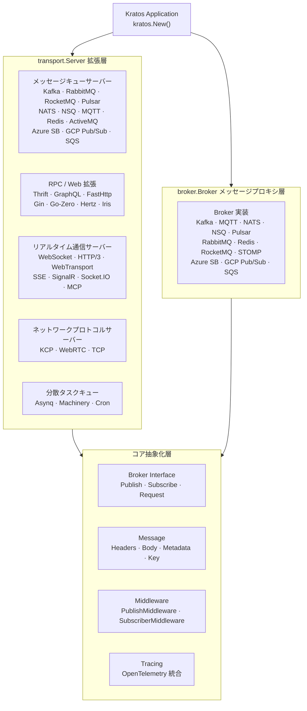

<p align="center">
  <h1 align="center">Kratos Transport</h1>
  <p align="center">
    <a href="https://go-kratos.dev/">Kratos</a> マイクロサービスフレームワーク向け統合トランスポート層・メッセージブローカー拡張セット
  </p>
  <p align="center">
    <em>一つの抽象化、30+ のトランスポートプロトコルを完全カバー、すぐに使える</em>
  </p>
</p>

<p align="center">
  <a href="README.md">中文</a> · <a href="README_en.md">English</a> · <a href="README_ja.md">日本語</a>
</p>

<p align="center">
  
  
  
  
  
  
</p>

---

## プロジェクトの特徴

- **30+ のトランスポートプロトコル・メッセージミドルウェアアダプタ**：RabbitMQ、Kafka、RocketMQ、Pulsar、NATS、NSQ、MQTT、Redis Stream、Azure Service Bus、GCP Pub/Sub、AWS SQS、WebSocket、HTTP/3、WebTransport、SSE、SignalR、Socket.IO、MCP、KCP、WebRTC... 主要なメッセージキュー、クラウドメッセージングサービス、RPCフレームワーク、リアルタイム通信プロトコルをワンストップでカバー
- **デュアルモード統合**：`transport.Server` 実装は Kratos サービスライフサイクルに直接登録可能、スタンドアロンの `broker.Broker` インターフェースはピュアメッセージプロキシシナリオをサポート — 必要に応じて選択可能
- **ジェネリクス型安全性**：Go 1.18+ のジェネリクスを活用し、`TypedHandler[T]`、`Subscribe[T]`、`RegisterSubscriber[S, T]` などの型安全な API を提供 — `interface{}` のランタイムパニックにさよなら
- **統一メッセージ抽象化**：`broker.Message` が Headers / Body / Metadata / Partition / Offset を統一的にカプセル化し、基盤プロトコルの差異を吸収
- **オブザーバビリティ対応**：OpenTelemetry 分散トレーシング統合を内蔵、OTLP gRPC/HTTP、Jaeger、Zipkin などの主要エクスポーターをサポート — パブリッシュ/サブスクライブのフルリンクトレース
- **ミドルウェアチェーン**：パブリッシュ/サブスクライブ双方向ミドルウェア機構により、ロギング、メトリクス、トレーシング、レートリミットなどの横断的関心事を柔軟に注入
- **高信頼メッセージ配信**：RabbitMQ は Publisher Confirms（パブリッシュ確認）、Publisher Returns（メッセージ返却）、マルチ Exchange ルーティングをサポートし、メッセージの損失を防止
- **モジュール式オンデマンドインポート**：各 transport / broker 実装は独立した Go Module — 必要な依存関係のみをインポートし、依存関係の肥大化を回避

---

## アーキテクチャ概要



---

## サポート能力一覧

### メッセージキュー Transport Server

| ミドルウェア | 説明 | ドキュメント |
|-------------|------|-------------|
| RabbitMQ | AMQP 0-9-1 プロトコル、エンタープライズ非同期メッセージングに広く使用 | [README](./transport/rabbitmq/README.md) |
| Kafka | 高スループット分散イベントストリーミングプラットフォーム | [README](./transport/kafka/README.md) |
| RocketMQ | Alibaba レベルの分散メッセージミドルウェア | [README](./transport/rocketmq/README.md) |
| ActiveMQ | STOMP プロトコルによる ActiveMQ / Apollo 接続 | [README](./transport/activemq/README.md) |
| Pulsar | Apache Pulsar クラウドネイティブメッセージングプラットフォーム | [README](./transport/pulsar/README.md) |
| NATS | 軽量・高性能メッセージングシステム | [README](./transport/nats/README.md) |
| NSQ | リアルタイム分散メッセージングプラットフォーム | [README](./transport/nsq/README.md) |
| Redis | Redis Stream メッセージ消費 | [README](./transport/redis/README.md) |
| MQTT | IoT MQTT v3.1.1 / v5.0 プロトコル | [README](./transport/mqtt/README.md) |
| Azure Service Bus | Azure クラウドメッセージキューサービス | [README](./broker/azuresb/README.md) |
| GCP Pub/Sub | Google Cloud パブリッシュ/サブスクライブメッセージングサービス | [README](./broker/gcpubsub/README.md) |
| AWS SQS | Amazon Simple Queue Service | [README](./broker/sqs/README.md) |

### RPC / Web フレームワーク拡張

| フレームワーク | 説明 | ドキュメント |
|--------------|------|-------------|
| Thrift | Apache Thrift RPC プロトコル | [README](./transport/thrift/README.md) |
| GraphQL | GraphQL クエリ言語 | [README](./transport/graphql/README.md) |
| FastHttp | 高性能 HTTP フレームワーク fasthttp | [README](./transport/fasthttp/README.md) |
| Gin | Gin Web フレームワーク | [README](./transport/gin/README.md) |
| Go-Zero | go-zero マイクロサービスフレームワーク | [README](./transport/gozero/README.md) |
| Hertz | ByteDance CloudWeGo Hertz HTTP フレームワーク | [README](./transport/hertz/README.md) |
| Iris | Iris Web フレームワーク | [README](./transport/iris/README.md) |
| tRPC | Tencent tRPC マイクロサービスフレームワーク | [README](./transport/trpc/README.md) |

### 分散タスクキュー

| フレームワーク | 説明 | ドキュメント |
|--------------|------|-------------|
| Asynq | Redis ベースの非同期タスクキュー | [README](./transport/asynq/README.md) |
| Machinery | 分散タスク処理フレームワーク | [README](./transport/machinery/README.md) |
| Cron | 定時タスクスケジューリング | [README](./transport/cron/README.md) |
| HPTimer | 高精度タイマー | [README](./transport/hptimer/README.md) |

### リアルタイム通信プロトコル

| プロトコル | 説明 | ドキュメント |
|-----------|------|-------------|
| WebSocket | 全二重リアルタイム通信 | [README](./transport/websocket/README.md) |
| HTTP/3 | QUIC ベースの次世代 HTTP プロトコル | [README](./transport/http3/README.md) |
| WebTransport | QUIC ベースの Web トランスポートプロトコル | [README](./transport/webtransport/README.md) |
| SSE | Server-Sent Events サーバープッシュ | [README](./transport/sse/README.md) |
| SignalR | ASP.NET SignalR プロトコル | [README](./transport/signalr/README.md) |
| Socket.IO | Socket.IO リアルタイム通信プロトコル | [README](./transport/socketio/README.md) |
| MCP | Model Context Protocol（AI Agent 通信） | [README](./transport/mcp/README.md) |

### ネットワークプロトコル

| プロトコル | 説明 | ドキュメント |
|-----------|------|-------------|
| KCP | 高信頼 UDP プロトコル | [README](./transport/kcp/README.md) |
| WebRTC | P2P リアルタイム通信 | [README](./transport/webrtc/README.md) |
| TCP | 生 TCP ロングコネクション | [README](./transport/tcp/README.md) |

### Broker メッセージプロキシ

| ミドルウェア | 説明 | ドキュメント |
|-------------|------|-------------|
| Kafka | 高スループットイベントストリーム | [README](./broker/kafka/README.md) |
| MQTT | IoT メッセージングプロトコル | [README](./broker/mqtt/README.md) |
| NATS | 軽量メッセージングシステム | [README](./broker/nats/README.md) |
| NSQ | リアルタイムメッセージングプラットフォーム | [README](./broker/nsq/README.md) |
| Pulsar | クラウドネイティブメッセージングプラットフォーム | [README](./broker/pulsar/README.md) |
| RabbitMQ | AMQP メッセージミドルウェア | [README](./broker/rabbitmq/README.md) |
| Redis | Redis Stream メッセージング | [README](./broker/redis/README.md) |
| RocketMQ | Alibaba 分散メッセージミドルウェア | [README](./broker/rocketmq/README.md) |
| STOMP | STOMP プロトコルメッセージミドルウェア | [README](./broker/stomp/README.md) |
| Azure Service Bus | Azure クラウドメッセージキューサービス | [README](./broker/azuresb/README.md) |
| GCP Pub/Sub | Google Cloud パブリッシュ/サブスクライブメッセージングサービス | [README](./broker/gcpubsub/README.md) |
| AWS SQS | Amazon Simple Queue Service | [README](./broker/sqs/README.md) |

---

## 技術スタック

| レイヤー | 技術 | 説明 |
|---------|------|------|
| 言語 | Go 1.24+ | 高性能コンパイル言語 |
| フレームワーク | go-kratos v2 | Bilibili オープンソースマイクロサービスフレームワーク |
| トレーシング | OpenTelemetry | 統一オブザーバビリティ標準 |
| エクスポーター | OTLP / Jaeger / Zipkin | 複数のトレースエクスポートバックエンド |
| コーデック | JSON / Protobuf | 柔軟なシリアライゼーション方式 |
| TLS | crypto/tls | セキュアトランスポート層サポート |

---

## クイックスタート

### インストール

必要に応じてモジュールをインポート：

```bash
# Transport Server
go get github.com/tx7do/kratos-transport/transport/kafka
go get github.com/tx7do/kratos-transport/transport/rabbitmq
go get github.com/tx7do/kratos-transport/transport/websocket
go get github.com/tx7do/kratos-transport/transport/sse

# Broker
go get github.com/tx7do/kratos-transport/broker/kafka
go get github.com/tx7do/kratos-transport/broker/redis
```

### Transport Server として Kratos に統合

```go
package main

import (
    "context"
    "log"

    "github.com/go-kratos/kratos/v2"
    kfk "github.com/tx7do/kratos-transport/transport/kafka"
)

type Event struct {
    Message string `json:"message"`
}

func main() {
    ctx := context.Background()

    kafkaSrv := kfk.NewServer(
        kfk.WithAddress("localhost:9092"),
        kfk.WithSubscribe("test-topic", "test-group", handleMessage),
    )

    app := kratos.New(
        kratos.Name("my-service"),
        kratos.Server(kafkaSrv),
    )

    if err := app.Run(); err != nil {
        log.Fatal(err)
    }
}

func handleMessage(ctx context.Context, topic string, headers broker.Headers, msg *Event) error {
    log.Printf("received: %s", msg.Message)
    return nil
}
```

### スタンドアロン Broker として使用

```go
package main

import (
    "context"
    "log"

    "github.com/tx7do/kratos-transport/broker"
    kfk "github.com/tx7do/kratos-transport/broker/kafka"
)

func main() {
    ctx := context.Background()

    b := kfk.NewBroker(
        broker.WithAddress("localhost:9092"),
    )

    if err := b.Connect(); err != nil {
        log.Fatal(err)
    }
    defer b.Disconnect()

    // メッセージのパブリッシュ
    _ = b.Publish(ctx, "test-topic", broker.NewMessage([]byte(`{"hello":"world"}`)))

    // メッセージのサブスクライブ
    _, _ = broker.Subscribe[[]byte](b, "test-topic",
        func(ctx context.Context, topic string, headers broker.Headers, msg *[]byte) error {
            log.Printf("received: %s", string(*msg))
            return nil
        },
    )
}
```

---

## コア抽象化

### Broker Interface

`broker.Broker` は全メッセージブローカー実装のトップレベルインターフェースです：

```go
type Broker interface {
    Name() string
    Options() Options
    Address() string
    Init(...Option) error
    Connect() error
    Disconnect() error
    Publish(ctx context.Context, topic string, msg *Message, opts ...PublishOption) error
    Subscribe(topic string, handler Handler, binder Binder, opts ...SubscribeOption) (Subscriber, error)
    Request(ctx context.Context, topic string, msg *Message, opts ...RequestOption) (*Message, error)
}
```

### Message

基盤プロトコルの差異を吸収する統一メッセージモデル：

```go
type Message struct {
    ID        string          // メッセージ ID
    Headers   Headers         // メッセージヘッダー
    Body      any             // メッセージボディ
    Key       string          // パーティションキー（Kafka Key / RabbitMQ RoutingKey）
    Metadata  Metadata        // メタデータ
    Partition int             // パーティション番号
    Offset    int64           // オフセット
    Msg       any             // 生メッセージ
}
```

### ジェネリックハンドラー

Go ジェネリクスを活用し、コンパイル時の型安全性を実現：

```go
// ジェネリックサブスクライブ（Broker 層）
broker.Subscribe[MyEvent](b, "topic", handler)

// ジェネリック登録（Transport 層）
transport.RegisterSubscriber[MyServer](srv, ctx, "topic", "group", false, handler)
```

### ミドルウェア

パブリッシュ/サブスクライブ双方向ミドルウェアチェーンをサポート：

```go
// パブリッシュミドルウェア
b := kfk.NewBroker(
    broker.WithPublishMiddlewares(loggingMiddleware, tracingMiddleware),
)

// サブスクライブミドルウェア
b := kfk.NewBroker(
    broker.WithSubscriberMiddlewares(metricsMiddleware, recoveryMiddleware),
)
```

---

## プロジェクト構造

```
kratos-transport/
├── broker/                     # メッセージブローカー抽象化とマルチ実装
│   ├── kafka/                  # Kafka Broker
│   ├── mqtt/                   # MQTT Broker
│   ├── nats/                   # NATS Broker
│   ├── nsq/                    # NSQ Broker
│   ├── pulsar/                 # Pulsar Broker
│   ├── rabbitmq/               # RabbitMQ Broker
│   ├── redis/                  # Redis Broker
│   ├── rocketmq/               # RocketMQ Broker
│   ├── azuresb/                # Azure Service Bus Broker
│   ├── gcpubsub/               # GCP Pub/Sub Broker
│   ├── sqs/                    # AWS SQS Broker
│   ├── stomp/                  # STOMP Broker
│   ├── broker.go               # Broker インターフェース定義
│   ├── message.go              # 統一メッセージモデル
│   ├── options.go              # Broker グローバル設定
│   ├── publish.go              # パブリッシュミドルウェアチェーン
│   ├── subscriber.go           # サブスクライバー管理（スレッドセーフ）
│   └── typed_handler.go        # ジェネリックハンドラー
├── transport/                  # Transport Server 拡張
│   ├── activemq/               # ActiveMQ Transport
│   ├── asynq/                  # Asynq 非同期タスクキュー
│   ├── azuresb/               # Azure Service Bus Transport
│   ├── cron/                   # 定時タスクスケジューリング
│   ├── fasthttp/               # FastHttp Transport
│   ├── gcpubsub/               # GCP Pub/Sub Transport
│   ├── gin/                    # Gin Transport
│   ├── gozero/                 # Go-Zero Transport
│   ├── graphql/                # GraphQL Transport
│   ├── hertz/                  # Hertz Transport
│   ├── hptimer/                # 高精度タイマー
│   ├── http3/                  # HTTP/3 + QUIC Transport
│   ├── iris/                   # Iris Transport
│   ├── kafka/                  # Kafka Transport
│   ├── kcp/                    # KCP Transport
│   ├── keepalive/              # Keep-Alive Transport
│   ├── machinery/              # Machinery タスクキュー
│   ├── mcp/                    # MCP (Model Context Protocol)
│   ├── mqtt/                   # MQTT Transport
│   ├── nats/                   # NATS Transport
│   ├── nsq/                    # NSQ Transport
│   ├── pulsar/                 # Pulsar Transport
│   ├── rabbitmq/               # RabbitMQ Transport
│   ├── redis/                  # Redis Transport
│   ├── rocketmq/               # RocketMQ Transport
│   ├── signalr/                # SignalR Transport
│   ├── socketio/               # Socket.IO Transport
│   ├── sqs/                    # AWS SQS Transport
│   ├── sse/                    # SSE Transport
│   ├── tcp/                    # TCP Transport
│   ├── thrift/                 # Thrift RPC Transport
│   ├── trpc/                   # tRPC Transport
│   ├── webrtc/                 # WebRTC Transport
│   ├── websocket/              # WebSocket Transport
│   ├── webtransport/           # WebTransport Transport
│   ├── register.go             # ジェネリックサブスクライブ登録器
│   ├── options.go              # Transport グローバル設定
│   └── utils.go                # ネットワークユーティリティ関数
├── tracing/                    # 分散トレーシング拡張
│   ├── provider.go             # TracerProvider ファクトリ
│   ├── exporter.go             # マルチバックエンドエクスポーター
│   ├── tracer.go               # トレース注入/抽出
│   └── options.go              # トレーシング設定
├── _example/                   # サンプルプロジェクト
│   ├── broker/                 # Broker 使用例
│   └── server/                 # Server 使用例
├── testing/                    # テストユーティリティ
├── script/                     # 補助スクリプト
├── Makefile                    # ビルドスクリプト
└── LICENSE                     # MIT ライセンス
```

---

## サンプルプロジェクト

| プロジェクト | 説明 |
|------------|------|
| [kratos-chatroom](https://github.com/tx7do/kratos-chatroom) | WebSocket リアルタイムチャットルーム |
| [kratos-cqrs](https://github.com/tx7do/kratos-cqrs) | CQRS アーキテクチャサンプル（Kafka + MongoDB） |
| [kratos-realtimemap](https://github.com/tx7do/kratos-realtimemap) | IoT リアルタイムマップ（MQTT + WebSocket） |
| [go-wind-uba](https://github.com/tx7do/go-wind-uba) | エンタープライズグレードのユーザー行動分析システム |
| [go-wind-admin](https://github.com/tx7do/go-wind-admin) | 管理画面ダッシュボードスキャフォールド |

> 上記のプロジェクトはすべて [Kratos 公式 Examples](https://github.com/go-kratos/examples) に収録されています。

---

## ユースケース

- **メッセージキュー統合**：Kafka / RabbitMQ / RocketMQ などのメッセージキューを Kratos マイクロサービスフレームワーク下に統合
- **リアルタイム通信サービス**：WebSocket / SSE / SignalR / Socket.IO などのリアルタイム通信機能を必要とするマイクロサービス
- **IoT バックエンド**：MQTT プロトコルで IoT デバイスを接続し、リアルタイムプッシュと連携
- **AI Agent 統合**：MCP プロトコルを通じて AI Agent にツール呼び出し機能を提供
- **非同期タスク処理**：Asynq / Machinery で分散タスクキューを構築
- **マルチプロトコルゲートウェイ**：単一サービス内で HTTP / gRPC / Thrift / GraphQL などの複数プロトコルを同時サポート
- **ピュアメッセージプロキシ**：Kratos フレームワーク依存なしでパブリッシュ/サブスクライブ機能のみが必要な場合

---

## コントリビューション

Issue と Pull Request を歓迎します！

1. このリポジトリをフォーク
2. フィーチャーブランチを作成 (`git checkout -b feature/amazing-feature`)
3. 変更をコミット (`git commit -m 'Add some amazing feature'`)
4. ブランチにプッシュ (`git push origin feature/amazing-feature`)
5. Pull Request を作成

---

## License

このプロジェクトは [MIT License](./LICENSE) の下でライセンスされています。
